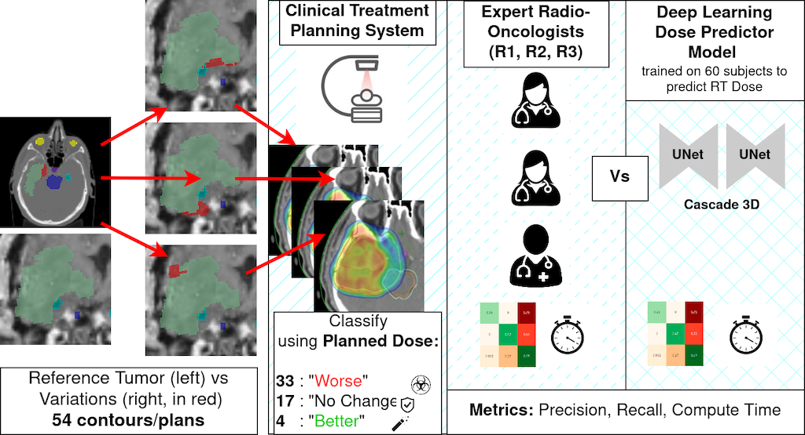

# Comparing the Performance of Radiation Oncologists versus a Deep Learning

   


This repository contains code to reproduce the analysis from our recent MIDL 2024 paper:

**"Comparing the Performance of Radiation Oncologists versus a Deep Learning Dose Predictor to Estimate Dosimetric Impact of Segmentation Variations for Radiotherapy"**  
*Amith Kamath\*, Zahira Mercado\*, Robert Poel, Jonas Willmann, Ekin Ermis, Elena Riggenbach, Nicolaus Andratschke, Mauricio Reyes*  
(\*Contributed equally)

Read the paper [here](https://openreview.net/pdf/5f8cbcc7c1bba1e30813f02448e4d7c8be57c3b2.pdf).  

Click here for the video recording of the oral talk:

[](https://youtu.be/Co9yUIAw6H0?t=3587 "Comparing the Performance of Radiation Oncologists versus a Deep Learning Dose Predictor")

🔗 [Project Website](https://amithjkamath.github.io/projects/2024-midl-radonc-vs-dldp/)

---

## Overview

Geometric metrics like Dice score often fail to capture the clinical impact of segmentation errors in radiotherapy. This project introduces a quality assurance (QA) framework using a deep learning-based dose prediction model to assess the **dosimetric impact** of segmentation variations in glioblastoma treatment planning.



The model's performance is compared with three experienced radiation oncologists on a test set of 54 tumor segmentation variants.

---

## Key Contributions

- A 3D dose prediction model using a cascaded U-Net architecture.
- Evaluation of the model’s ability to classify segmentation variants as:
  - **Sub-optimal**
  - **No Impact**
  - **Improved**
- Comparison with radiation oncologists in terms of precision, recall, and evaluation time.
- Analysis of sensitivity to dosimetric thresholds (α) and number of affected OARs (nOAR).

---

## Setup

### Installation

```bash
git clone https://github.com/amithjkamath/radonc-vs-dldp.git
cd radonc-vs-dldp
pip install -r requirements.txt
```

Run code/generate-figure-3.py and code/generate-figure-4.py to reproduce the analysis. Data required to generate figures 3 and 4 from the paper is included in radonc-vs-dldp-data.zip.

If this is useful in your research, please consider citing:

    @inproceedings{kamathcomparing,
      title={Comparing the Performance of Radiation Oncologists versus a Deep Learning Dose Predictor to Estimate Dosimetric Impact of Segmentation Variations for Radiotherapy},
      author={Kamath, Amith Jagannath and der Maur, Zahira Mercado Auf and Poel, Robert and Willmann, Jonas and Ermis, Ekin and Riggenbach, Elena and Andratschke, Nicolaus and Reyes, Mauricio},
      booktitle={Medical Imaging with Deep Learning}
    }
